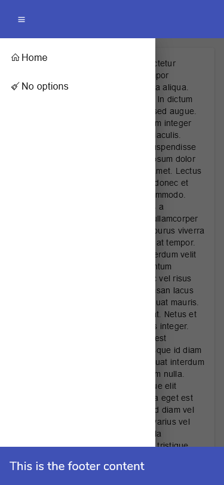

# NgxPerfectLayout

The perfect layout for your Angular app: responsiveness, eye candy and many other features.

## Why?

Because in each project based on the Angular framework I was copy/pasting the wheel, changing small details every time. Elder projects would not benefit from the enhancements made in new ones. A general frustration arose.

## Features

### Developer friendly

Just import the module in your app.module.ts

```typescript
import { NgxPerfectLayoutModule } from '@ziocampo/ngx-perfect-layout';

imports: [
    NgxPerfectLayoutModule,
]
```

Then use the component in any page you want:

```html
<ngx-perfect-main-layout>
    <ngx-perfect-page-content>
        This is the page content.
    </ngx-perfect-page-content>
    <ngx-perfect-page-footer>
        This is the footer content
    </ngx-perfect-page-footer>
</ngx-perfect-main-layout>
```

For more details refer to the showcase project.

🔥 Hint: you could even use it on the app.component.tml itself, putting the ```router-outlet``` inside the ```ngx-perfect-page-content```.

### A decent layout, optimized for responsiveness

Layout automatically adapts to many resolutions, from large panels to small ones.

Snap points are the ones that come with the [@angular/flex-layout](https://www.npmjs.com/package/@angular/flex-layout) package.


### A nice "wait" animation

Just by toggling a bool option you can display a nice wait animation.

```html
[showWaitingAnimation]="true"
```


### Support for your own themes or for the standard ones

It supports standard Angular themes (Indigo Pink etc.) as well as custom ones you can craft manually or at [Material Theme Generator](https://materialtheme.arcsine.dev/)

To provide a list of custom themes declare a list of Theme objects:

```typescript
import { Theme } from '@ziocampo/ngx-perfect-layout';

public themes: Theme[] = [{
    displayName: "Blue tango",
    name: "blue-tango-theme"
}, {
    displayName: "Coffee",
    name: "coffee-theme"
}, {
    displayName: "Relax",
    name: "relax-theme"
}];
```

then assign it to the themes parameter:

```html
[themes]="themes"
```

The themes will be displayed in a ```mat-select``` within the app drawer and applied upon the ```(selectionChange)```.



## Options

Run `ng build` to build the project. The build artifacts will be stored in the `dist/` directory.

## Running unit tests

Run `ng test` to execute the unit tests via [Karma](https://karma-runner.github.io).

## Running end-to-end tests

Run `ng e2e` to execute the end-to-end tests via a platform of your choice. To use this command, you need to first add a package that implements end-to-end testing capabilities.

## Further help

To get more help on the Angular CLI use `ng help` or go check out the [Angular CLI Overview and Command Reference](https://angular.io/cli) page.
