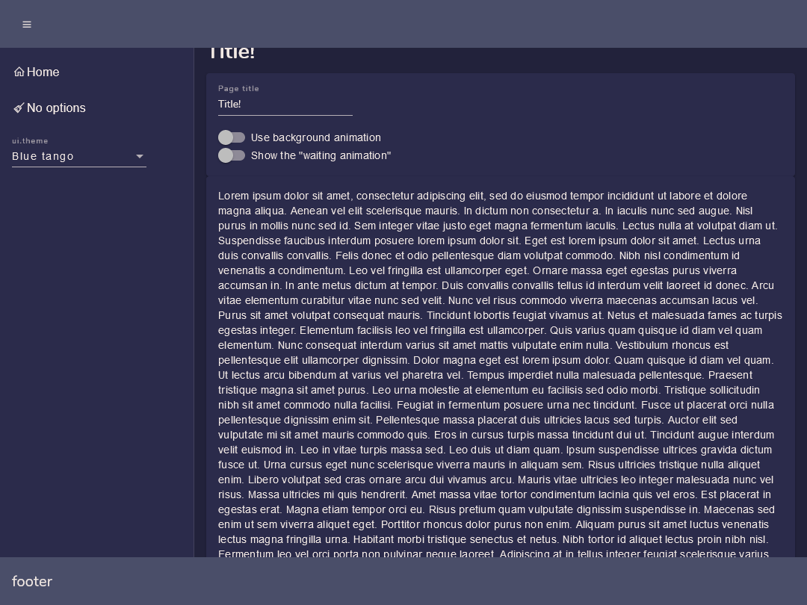
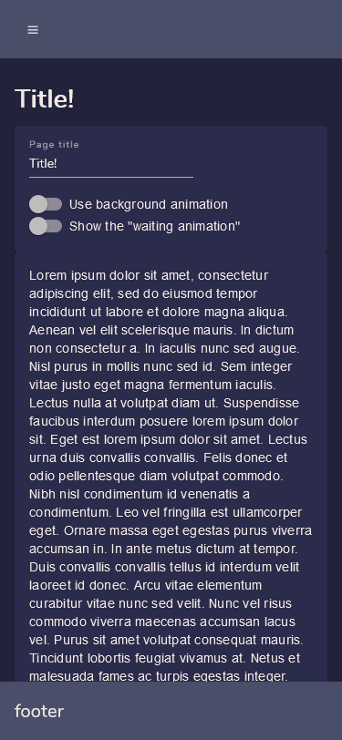
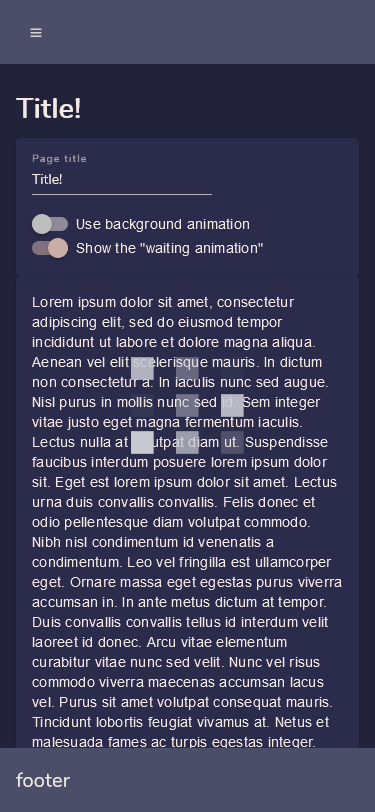
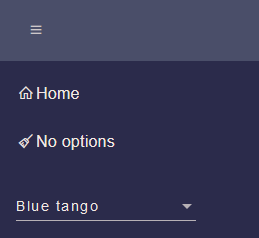

# NgxPerfectLayout

The perfect layout for your Angular app: responsiveness, eye candy and many other features.

## Why?

Because in each project based on the Angular framework I was copy/pasting the wheel, changing small details every time. Elder projects would not benefit from the enhancements made in new ones. A general frustration arose.

## Features

### Developer friendly

Just import the module in your app.module.ts

```typescript
import { NgxPerfectLayoutModule, NgxPerfectLayoutService } from '@ziocampo/ngx-perfect-layout';

imports: [
    NgxPerfectLayoutModule,
],  
providers: [
    NgxPerfectLayoutService
]
```

Then use the component right in the app.component.html:

```html
<ngx-perfect-main-layout>
    <ngx-perfect-page-header-left>
        header left zone
    </ngx-perfect-page-header-left>
    <ngx-perfect-page-header-right>
        header right zone
    </ngx-perfect-page-header-right>
    <ngx-perfect-page-content>
        <router-outlet></router-outlet>
    </ngx-perfect-page-content>
    <ngx-perfect-page-footer-left>
        footer left zone
    </ngx-perfect-page-footer-left>
    <ngx-perfect-page-footer-right>
        footer right zone
    </ngx-perfect-page-footer-right>
</ngx-perfect-main-layout>
```

For more details refer to the showcase project.

### Service centerer for options

NgxPerfectLayout is centered around the NgxPerfectLayoutService. Any options you should want to set are there. In any component you can ask for the service by DI:

```typescript
import { NgxPerfectLayoutService } from '@ziocampo/ngx-perfect-layout';

constructor(
  private _layoutService: NgxPerfectLayoutService
) { }
```

and then set some option as shown below.

### A decent layout, optimized for responsiveness

Layout automatically adapts to many resolutions, from large panels to small ones.

Snap points are the ones that come with the [@angular/flex-layout](https://www.npmjs.com/package/@angular/flex-layout) package.





### A nice "wait" animation

Just by toggling a bool option you can display a nice wait animation.

```html
this._layoutService.showWaitingAnimation = true;
```



### Support for your own themes or for the standard ones

NgxPerfectLayout supports standard Angular themes (Indigo Pink etc.) as well as custom ones you can craft manually or at [Material Theme Generator](https://materialtheme.arcsine.dev/)

To provide a list of custom themes just import them as usual in your ```styles.scss``` and declare a list of ```Theme``` objects:

```typescript
import { Theme } from '@ziocampo/ngx-perfect-layout';

public themes: Theme[] = [{
    displayName: "Blue tango",
    name: "blue-tango-theme"
}, {
    displayName: "Coffee",
    name: "coffee-theme"
}, {
    displayName: "Relax",
    name: "relax-theme"
}];
```

then assign it to the ```themes``` parameter:

```html
this._layoutService.themes = themes;
```

The themes will be displayed in a ```mat-select``` within the app drawer and applied upon the ```(selectionChange)```.



### Menu from angular routes, the easy way

When you define your routes, just add a ```data``` element of type ```RouteData```

```typescript
import { RouteData } from '@ziocampo/ngx-perfect-layout';

export const routes: Routes = [
  {
    path: "",
    pathMatch: "full",
    redirectTo: "home"
  },
  {
    path: "home", 
    component: HomePageComponent,
    data:{
      displayName: "Home",
      iconClass: "la-home"
    } as RouteData
  },
  {
    path: "no-options", 
    component: NoOptionsPageComponent,
    data:{
      displayName: "No options",
      iconClass: "la-broom"
    } as RouteData
  }
];

```

then pass your routes to the ```routes``` parameter. Routes containing a ```RouteData``` element with a ```displayName``` will be shown as navigation.

```typescript
this._layoutService.routes = routes;
```

## All the options

| Option                 | Meaning                                                                                                   | Type    | Default value |
|------------------------|-----------------------------------------------------------------------------------------------------------|---------|---------------|
| title                  | The title of the page. If provided the page will display an H1 tag with the title.                        | string  | undefined     |
| routes                 | A Routes object.                                                                                          | Routes  | undefined     |
| themes                 | An array of Theme objects. If provided there will be a select in the drawer to allow switching the theme. | Theme[] | []            |
| showWaitingAnimation   | If set to true a nice wait animation will be shown.                                                       | boolean | false         |
| useBackgroundAnimation | If set to true a nice animated background will be shown on the drawer.                                    | boolean | false         |
| loginMode | If set to true hides anything not compatible with a login page, e.g.: drawer. | boolean | false         |
| hamburgerMenuButtonPosition | Position of the drawer and fo the drawer tobble. | "left", "right" | "left" |
